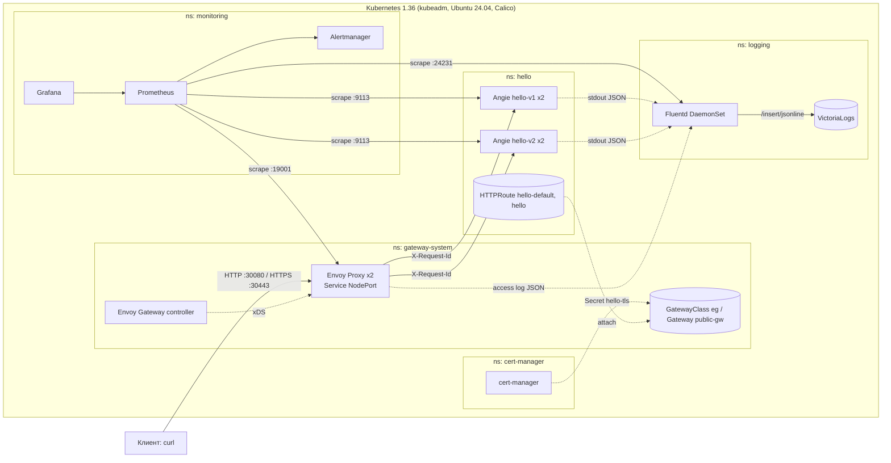

# Hello Platform: Kubernetes + Gateway API + Prometheus + Fluentd

Инфраструктура как код для кейса «DevOps» (MTC ENGINEER HACK): на чистой Ubuntu 24.04 одна команда
`make deploy` поднимает kubeadm-кластер Kubernetes, приложение Angie (`Hello World!`), доступ через
Gateway API (Envoy Gateway), мониторинг (Prometheus) и сбор логов (Fluentd → VictoriaLogs), а `make verify`
сама доказывает, что всё работает.

## Быстрый старт

```bash
git clone https://github.com/danil-prog-coder/MTC_engineer_HACK.git && cd MTC_engineer_HACK
make deploy     # кластер + платформа + приложение (Ubuntu 24.04, sudo без пароля)
make verify     # отчёт-доказательство: artifacts/verification-report.md
curl http://$(hostname -I | awk '{print $1}'):30080/     # Hello World!
```

Где что проверять: приложение и Gateway API — [раздел 9](#9-проверка-доступности-приложения), мониторинг —
[раздел 10](#10-проверка-мониторинга), логирование — [раздел 11](#11-проверка-логирования),
дополнительные возможности — [раздел 13](#13-дополнительные-возможности), ограничения — [раздел 15](#15-известные-ограничения).

## 1. Краткое описание решения

| Что | Как |
|---|---|
| Кластер | kubeadm, Kubernetes 1.36, один узел (control-plane без taint), Calico (NetworkPolicy работает) |
| Приложение | Angie (форк nginx), 2 варианта `hello-v1` / `hello-v2` по 2 реплики, отдаёт `Hello World!` |
| Доступ | Gateway API: Envoy Gateway → `GatewayClass` → `Gateway` → `HTTPRoute` → `Service`; NodePort **30080** |
| Метрики | kube-prometheus-stack: Prometheus, Alertmanager, Grafana, node-exporter, kube-state-metrics |
| Логи | Fluentd (DaemonSet) → VictoriaLogs; сквозной `request_id` от Gateway до приложения |
| Автоматизация | Ansible (хост, kubeadm, Helm-чарты, Kustomize-манифесты), точка входа — `Makefile` |
| Доказательство | `make verify` → `artifacts/verification-report.md` (реальные ответы curl, PromQL и логов) |

Никаких ручных правок манифестов: IP узла определяется автоматически, версии всех компонентов зафиксированы
в [`versions.yaml`](versions.yaml), тегов `latest` нет, секретов в репозитории нет (пароли генерируются при деплое).

## 2. Архитектура

Подробно — в [docs/architecture.md](docs/architecture.md).



Потоки данных:

| Поток | Путь | Формат |
|---|---|---|
| Пользовательский трафик | Клиент → Envoy (NodePort 30080 HTTP / 30443 HTTPS, TLS завершается на Envoy) → Service `hello` → Angie :8080 | HTTP / HTTPS |
| Метрики | Angie :9113, Envoy :19001, Fluentd :24231, kubelet, node-exporter и др. → Prometheus | pull, Prometheus exposition |
| Логи | stdout контейнеров → `/var/log/containers` → Fluentd (tail) → VictoriaLogs | CRI → JSON → HTTP JSON lines |

## 3. Технологии и версии

Единственный источник версий — [`versions.yaml`](versions.yaml). Значения, помеченные там `(verify)`,
сверяются на стенде по [docs/VERIFY_ON_VM.md](docs/VERIFY_ON_VM.md).

| Компонент | Версия | Установка |
|---|---|---|
| Ubuntu | 24.04 LTS | — |
| containerd | из репозитория Ubuntu, `apt-mark hold` | Ansible |
| kubeadm / kubelet / kubectl | 1.36.4 | Ansible, `pkgs.k8s.io`, `apt-mark hold` |
| Helm | v3.17.3 | Ansible, бинарник с get.helm.sh (проверка sha256) |
| Calico (Tigera operator) | v3.31.0 | Ansible, манифест |
| local-path-provisioner | v0.0.32 | Ansible, манифест (StorageClass по умолчанию) |
| Gateway API CRD (Standard) | v1.6.1 | Helm `gateway-crds-helm` |
| Envoy Gateway | v1.9.2 | Helm OCI `gateway-helm` |
| cert-manager | v1.19.1 | Helm |
| kube-prometheus-stack | 77.13.0 | Helm |
| VictoriaLogs (`victoria-logs-single`) | чарт 0.11.12 | Helm |
| Grafana, Prometheus, Alertmanager | в составе kube-prometheus-stack 77.13.0 | Helm |
| Angie | 1.12.1-minimal | Kustomize |
| Fluentd | v1.19.3 (образ `fluentd-kubernetes-daemonset`) | Kustomize |
| Ansible (контроллер) | ansible-core 2.18.19 в `.venv` | `make bootstrap` |
| Python-тулинг `hackops` | Python 3.12 (штатный в Ubuntu 24.04) | `make bootstrap` |

Все компоненты open-source, коммерческих сервисов и облачных провайдеров нет.
Образы публичные (Docker Hub, `docker.angie.software`), собирать ничего не нужно.

## 4. Версия Kubernetes и способ создания кластера

- **Kubernetes 1.36.4**, кластер создаётся **kubeadm** (`kubeadm init --config`, конфигурация — шаблон
  [`kubeadm-config.yaml.j2`](ansible/roles/kubeadm_init/templates/kubeadm-config.yaml.j2)).
- **ОС тестирования:** Ubuntu 24.04 LTS (cgroup v2, `SystemdCgroup = true` в containerd).
- Топология: один узел, taint control-plane снимается. CNI — Calico (VXLAN, pod CIDR 10.244.0.0/16).
- Метрики control-plane (controller-manager, scheduler, etcd, kube-proxy) слушают на 0.0.0.0 — иначе их
  targets в Prometheus красные; kubelet использует `serverTLSBootstrap`, CSR одобряется автоматически.
- Почему 1.36: версия входит в диапазон Kubernetes, поддерживаемый Envoy Gateway v1.9; патч-версия
  зафиксирована в `versions.yaml` и пакеты стоят на `apt-mark hold`.

## 5. Реализация Gateway API

**Реализация: Envoy Gateway v1.9.2** (Envoy Proxy поставляется чартом), **Gateway API CRD v1.6.1, канал Standard**.

| Ресурс | Namespace | Назначение |
|---|---|---|
| `EnvoyProxy/public-proxy` | gateway-system | 2 реплики Envoy, Service NodePort `30080` (HTTP) и `30443` (HTTPS), `externalTrafficPolicy: Local`, JSON access-лог, Prometheus-метрики |
| `GatewayClass/eg` | (cluster) | контроллер `gateway.envoyproxy.io/gatewayclass-controller`, параметры — `public-proxy` |
| `Gateway/public-gw` | gateway-system | listener `http:80` и `https:443` (TLS Terminate, Secret `hello-tls`); маршруты допускаются только из namespace с меткой `gateway-access: "true"` |
| `ClientTrafficPolicy/preserve-request-id` | gateway-system | сохраняет `X-Request-Id` клиента (сквозной id для логов) |
| `HTTPRoute/hello-default` | hello | без hostname: `/` → Service `hello` (проверка по IP без заголовка Host) |
| `HTTPRoute/hello` | hello | `hello.hack.local` (HTTP и HTTPS): заголовок `x-variant: v2` → `hello-v2`; остальное — `hello-v1`/`hello-v2` в пропорции 90/10 |
| `HTTPRoute/hello-redirect` | hello | `secure.hack.local` на :80 → 301 на `https://hello.hack.local:30443` |
| `BackendTrafficPolicy/hello-limits` | hello | local rate limit 100 rps (429) и ретраи для `HTTPRoute/hello` |

Роли по namespace: инфраструктура (Gateway) — `gateway-system`, приложение (маршруты) — `hello`.

## 6. Требования к среде

- Чистая **Ubuntu 24.04 LTS** (сервер), одна ВМ или железо. Рекомендуется 4 vCPU / 8 ГБ RAM / 40 ГБ диска
  (минимум по preflight — 2 vCPU и 4 ГБ RAM).
- Пользователь с **sudo без пароля** (или запуск от root).
- Доступ в интернет: `pkgs.k8s.io`, `github.com`/`raw.githubusercontent.com`, Docker Hub,
  `docker.angie.software`, `charts.jetstack.io`, `prometheus-community.github.io`,
  `victoriametrics.github.io`, PyPI, `galaxy.ansible.com`.
- Свободные порты: 6443, 30080, 30443 (preflight проверяет их до установки кластера).
- Имена `hello.hack.local` и `secure.hack.local` в DNS не нужны: в проверках используется заголовок `Host`
  или `curl --resolve`; для браузера добавьте их в `/etc/hosts` с IP узла.

## 7. Развёртывание: пошагово

```bash
git clone https://github.com/danil-prog-coder/MTC_engineer_HACK.git
cd MTC_engineer_HACK
make deploy      # ~15 минут на ВМ 4 vCPU / 8 ГБ, зависит от скорости скачивания образов
make verify      # отчёт-доказательство
```

Ничего редактировать не нужно. Необязательные параметры (файл `.env`, пример — `.env.example`, либо переменные
окружения): `NODE_IP` (по умолчанию определяется автоматически), `DOMAIN` (`hack.local`), `INVENTORY`.

**Сеть с блокировками.** По умолчанию всё качается из upstream. Если с ВМ недоступны pypi.org, Docker Hub,
quay.io, CDN pkgs.k8s.io / registry.k8s.io (типично для VPS в РФ), подключите профиль зеркал: `cp mirrors-ru.env .env`
(переменные: `PIP_INDEX_URL`, `K8S_APT_REPO`, `DOCKERHUB_MIRRORS`, `QUAY_MIRRORS`, `K8S_REGISTRY_MIRRORS`,
`OCI_DOCKERHUB_MIRROR`, `CALICO_REGISTRY`, `GHCR_MIRROR`). Версии компонентов при этом не меняются. Зеркала реестров containerd настраиваются через
`/etc/containerd/certs.d/<registry>/hosts.toml`; upstream остаётся fallback-ом. Если get.helm.sh или galaxy.ansible.com
недоступны, срабатывают встроенные fallback-и: helm берётся из образа той же версии, коллекции — из пакета `ansible` с PyPI.

## 8. Команда запуска и что она делает

Одна команда: **`make deploy`**. Порядок (Ansible-роли в [`ansible/site.yml`](ansible/site.yml)):

1. `bootstrap` — `python3-venv`, `.venv` с ansible-core и `hackops`, коллекции Ansible;
2. `preflight` — ОС, ресурсы, доступ в интернет, порты;
3. `os_prep`, `containerd`, `kubernetes_pkgs` — swap off, модули ядра, sysctl, containerd, kubeadm/kubelet/kubectl, Helm;
4. `kubeadm_init` — кластер, kubeconfig для root и запустившего пользователя, снятие taint, одобрение kubelet-serving CSR;
5. `cni_calico`, `storage_local_path` — сеть и хранилище;
6. `namespaces`, `secrets` — namespace с метками PSA, пароль Grafana генерируется и кладётся в Secret;
7. `cert_manager`, `envoy_gateway`, `monitoring`, `logging` — платформа (Helm с фиксированными версиями + Kustomize);
8. `app_hello` — приложение и HTTPRoute;
9. `wait_ready` — ожидание готовности (`rollout status`, `Gateway Programmed`, HTTP 200 через Gateway) и сводка.

Идемпотентность: `make idempotency-check` запускает деплой второй раз и требует `changed=0`
(результат — `artifacts/idempotency.json`, учитывается в `make verify`). Остальные команды: `make help`.

## 9. Проверка доступности приложения

```bash
NODE_IP=$(hostname -I | awk '{print $1}')
curl -si http://$NODE_IP:30080/                      # 200, тело: Hello World!
curl -s  -H 'Host: hello.hack.local' http://$NODE_IP:30080/api/info   # JSON: версия, pod, request_id
curl -s  -H 'Host: hello.hack.local' -H 'x-variant: v2' http://$NODE_IP:30080/api/info   # всегда version v2
kubectl get gatewayclass,gateway,httproute -A        # Accepted / Programmed / ResolvedRefs = True
```

HTTPS и редирект (раздел 13): `make ca`, затем
`curl --cacert artifacts/ca.crt --resolve hello.hack.local:30443:$NODE_IP https://hello.hack.local:30443/` и
`curl -I -H 'Host: secure.hack.local' http://$NODE_IP:30080/` (301). Все эти проверки выполняет `make verify`.

## 10. Проверка мониторинга

Собираются метрики: Angie (встроенный шаблон `prometheus all`, порт 9113, `ServiceMonitor/hello`), Envoy Proxy
(`PodMonitor/envoy-proxy`, `/stats/prometheus`), Envoy Gateway controller, Fluentd (порт 24231), а также
kube-prometheus-stack: kubelet/cAdvisor, node-exporter, kube-state-metrics, apiserver, etcd, scheduler,
controller-manager, kube-proxy. Правила: [`k8s/base/monitoring/rules.yaml`](k8s/base/monitoring/rules.yaml)
(`HelloDown`, `GatewayHighErrorRate`, `LogPipelineBacklog`). Дашборды Grafana (Gateway/Envoy: rps, коды ответов,
latency p50/p95/p99, CPU/RAM; приложение и узел) загружаются из git автоматически.

```bash
kubectl -n monitoring port-forward svc/kps-prometheus 9090:9090 &   # затем http://localhost:9090/targets
curl -s 'http://localhost:9090/api/v1/query?query=up' | jq '.data.result | length'
curl -s 'http://localhost:9090/api/v1/query?query=sum(up{job="hello"})'
curl -s 'http://localhost:9090/api/v1/query?query=sum(envoy_cluster_upstream_rq_total)'
make creds       # пароль Grafana; kubectl -n monitoring port-forward svc/kps-grafana 3000:80
```

Все эти проверки выполняет и `make verify` (раздел R-12).

## 11. Проверка логирования

Собираются: access-логи приложения (JSON, `log_type=access`), error-лог Angie (`log_type=error`) и access-лог
Envoy (`log_type=gateway_access`). Fluentd читает `/var/log/containers`, обогащает метаданными Kubernetes и
отправляет в VictoriaLogs (`/insert/jsonline`, файловый буфер, хранение 7 дней). IP клиента в логах маскируется.

```bash
ID=demo-$(date +%s)
curl -s -H "X-Request-Id: $ID" http://$NODE_IP:30080/ ; sleep 10
make logs-find ID=$ID          # две записи: gateway_access (Envoy) и access (Angie) с одним request_id
make logs-query Q='log_type:error'
```

Веб-интерфейс: `kubectl -n logging port-forward svc/victoria-logs 9428:9428` → `http://localhost:9428/select/vmui`.

## 12. Автоматическая проверка всего: `make verify`

Вид вывода (пример). Команда возвращает 0 при успехе и пишет `artifacts/verification-report.md` и `.json`. Для каждого требования
кейса в отчёте — команда для ручного воспроизведения и реальный ответ:

```
[PASS] R-01/R-02 Узлы kubeadm-кластера Ready
[PASS] R-18  ОС Ubuntu 24.04
[PASS] R-01  Все поды решения Running/Ready
[PASS] R-09  GatewayClass Accepted / Gateway Programmed / HTTPRoute Accepted и ResolvedRefs
[PASS] R-06/R-11 GET / через Gateway -> Hello World!
[PASS] F-TLS HTTPS проверен корневым CA; HTTP -> HTTPS redirect 301
[PASS] F2    X-Request-Id возвращается клиентом
[PASS] R-14/R-15/R-16/F2 Запрос найден в логах: gateway_access + access (один request_id)
[PASS] R-14  error-лог приложения собран
[PASS] R-12  Все Prometheus targets up / метрики Angie / метрики Envoy
[PASS] R-08  Все образы с фиксированным тегом (нет latest)
[PASS] R-20  Повторный запуск: changed=0        (после make idempotency-check)
```

## 13. Дополнительные возможности

| Возможность | Как проверить |
|---|---|
| **F1. Отчёт-доказательство** (Evidence-as-Code) | `make verify` |
| **F2. Сквозной `request_id`** Gateway → приложение → логи → заголовок ответа | `curl -si -H 'X-Request-Id: x1' http://$NODE_IP:30080/` и `make logs-find ID=x1` |
| **Тест идемпотентности** | `make idempotency-check` → `changed=0` |
| Traffic splitting 90/10 и маршрутизация по заголовку (`x-variant`) | раздел 9, `kubectl get httproute hello -n hello -o yaml` |
| Разделение ролей Gateway API по namespace, допуск маршрутов по метке | `kubectl get ns --show-labels`, `Gateway/public-gw` |
| NetworkPolicy (default-deny в `hello`), PSA `restricted`, PDB, пробы, 2 реплики | `kubectl get netpol,pdb -n hello` |
| Сводка линтеров и unit-тестов | `make lint`, `make test` |
| **TLS на Gateway**: cert-manager (selfSigned → корневой CA → сертификат), listener `https` :30443 | `make ca`; `curl --cacert artifacts/ca.crt --resolve hello.hack.local:30443:$NODE_IP https://hello.hack.local:30443/` |
| **HTTP → HTTPS redirect** (`HTTPRoute/hello-redirect`, 301) | `curl -I -H 'Host: secure.hack.local' http://$NODE_IP:30080/` |
| **Rate limit и ретраи** (`BackendTrafficPolicy/hello-limits`: 100 rps, ответ 429) | `kubectl get backendtrafficpolicy -n hello` |
| **Дашборды Grafana** (Gateway/Envoy, приложение и узел), загружаются автоматически из git | Grafana → Dashboards → «Hello Platform» |
| **CI** (GitHub Actions: yamllint, ruff/mypy, pytest, kustomize+kubeconform, ansible syntax-check) | `.github/workflows/ci.yml` |

Остальные возможности из плана (SLO, сверка логов, бизнес-метрики) в этой версии **не реализованы** и не заявляются.

## 14. Безопасность и надёжность

- Секретов в репозитории нет. Пароль Grafana генерируется при деплое (`/etc/hackops/secrets`, права 0700/0600),
  создаётся Kubernetes Secret; показать — `make creds`.
- Pod Security Admission: `hello` — `restricted` (enforce), `gateway-system` и `cert-manager` — `baseline`.
- TLS на Gateway (cert-manager, ECDSA P-256, автоматическое продление), rate limit на маршруте `hello`.
- Приложение: non-root (uid 101), `readOnlyRootFilesystem`, `drop ALL`, seccomp `RuntimeDefault`, лимиты ресурсов.
- NetworkPolicy в `hello`: default-deny; разрешены Envoy → 8080, Prometheus → 9113 и DNS.
- Fluentd ≥ 1.19.3, `monitor_agent` не используется.
- Все версии зафиксированы, `latest` нет (проверка — в `make verify`), пакеты Kubernetes на `apt-mark hold`.

## 15. Известные ограничения

- Один узел control-plane: нет HA. Worker-узлы добавляются `kubeadm join` вручную, автоматизации нет.
- Доступ по NodePort 30080 (HTTP) и 30443 (HTTPS), а не 80/443: облачного LoadBalancer нет. `EXPOSE=metallb` зарезервирован в
  настройках, но **не реализован**.
- TLS — самоподписанный корневой CA (`make ca` сохраняет его в `artifacts/ca.crt`); публично доверенный
  сертификат (Let's Encrypt) потребует публичный домен. Basic-auth админ-UI не реализован.
- Grafana, Prometheus и UI логов не опубликованы через Gateway — доступ через `kubectl port-forward`.
- Namespace `logging` (Fluentd читает `/var/log` узла) и `monitoring` (node-exporter: hostPath/hostNetwork)
  работают с PSA `privileged` — осознанное исключение. По ТЗ `monitoring` предполагался `baseline`.
- Метрики control-plane открыты на IP узла (нужно Prometheus на kubeadm); в продакшене — firewall.
- Endpoint `/__error_demo` доступен через Gateway: он нужен `make verify`, чтобы гарантированно породить error-лог.
- Многострочные (частичные) CRI-логи не склеиваются — для JSON access-логов не требуется.
- Хранилища (Prometheus, VictoriaLogs) — local-path на диске узла, без резервного копирования.
- Поддерживается только Ubuntu 24.04; preflight отказывает на других ОС.

## 16. Удаление стенда

```bash
make destroy CONFIRM=yes    # kubeadm reset, очистка /etc/kubernetes, /var/lib/etcd, CNI, /etc/hackops, kubeconfig
```

Без `CONFIRM=yes` команда ничего не делает. Пакеты (containerd, kubeadm, helm) остаются на хосте.

## 17. Структура репозитория

```
Makefile                 точка входа (make help)
versions.yaml            единственный источник версий
ansible/                 site.yml и роли (preflight … wait_ready)
helm-values/             values Helm-чартов (Envoy Gateway, kube-prometheus-stack, VictoriaLogs)
k8s/base/                Kustomize: namespaces, gateway, tls, hello, logging, monitoring (+ дашборды Grafana)
k8s/overlays/kubeadm/    сборка приложения для стенда
tools/hackops/           Python-тулинг: verify, logs-find, logs-query, idempotency (+ unit-тесты)
scripts/                 gen_hello.py (hello-v1/v2 из одного шаблона), gen_dashboards.py, destroy.sh
.github/workflows/       CI (ci.yml)
docs/                    architecture.md, VERIFY_ON_VM.md
```
